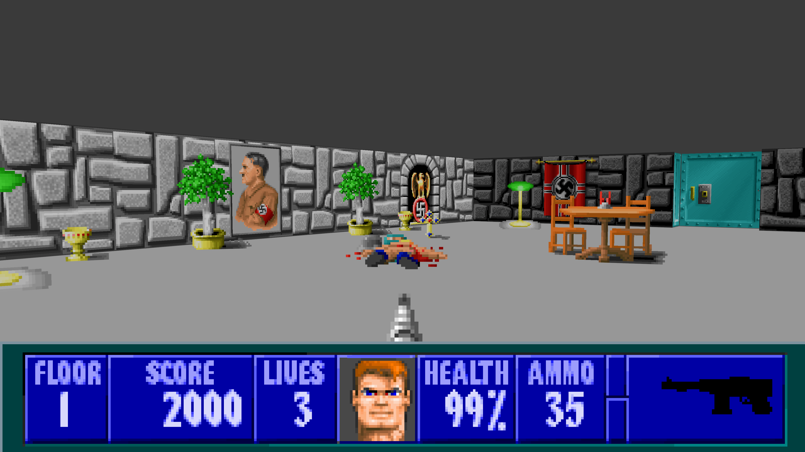
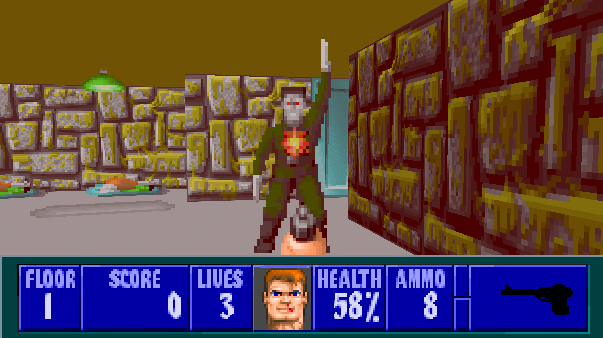
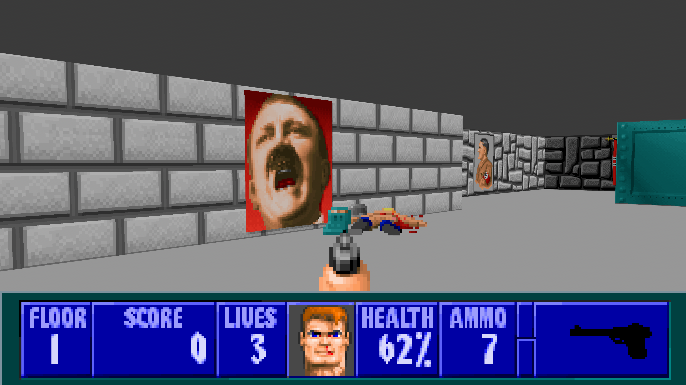
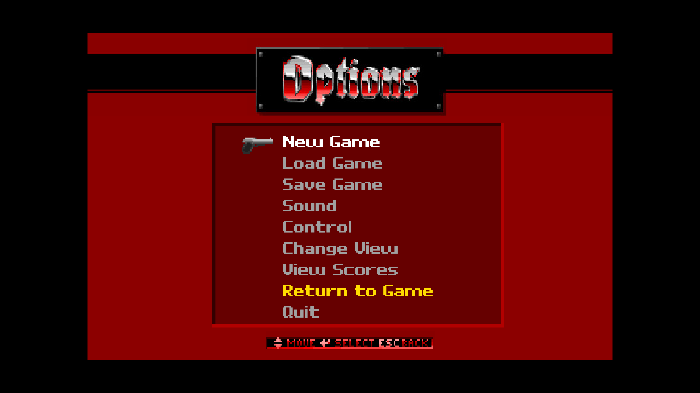

# Davenstein

A ground-up recreation of Wolfenstein 3-D, engineered entirely in Rust with Bevy. Davenstein reimplements Wolfenstein 3-D as a native, idiomatic Rust application rather than porting or wrapping the original C code or another legacy engine

Created and maintained by **[David Petnick](https://github.com/Ophois47)**



## Releases

Prebuilt packages are published on [GitHub Releases](https://github.com/Ophois47/Davenstein/releases)

| Platform | Architecture | Package | Recommended use |
| --- | --- | --- | --- |
| Windows | x86_64 | Installer | Normal Windows installation |
| Windows | x86_64 | Portable ZIP | Portable installation |
| Windows | ARM64 / AArch64 | Portable ZIP | Windows on ARM systems |
| Linux | x86_64 | AppImage | Normal Linux desktop use |
| Linux | x86_64 | Portable TAR.GZ | Extracted portable installation |
| Linux | ARM64 / AArch64 | AppImage | Normal ARM64 Linux desktop use |
| Linux | ARM64 / AArch64 | Portable TAR.GZ | Extracted ARM64 portable installation |
| Linux | ARMv7 / ARMHF | Portable TAR.GZ | Extracted ARMv7 hard-float portable installation |
| FreeBSD | x86_64 / AMD64 | Native PKG | Normal FreeBSD 14 installation |
| FreeBSD | x86_64 / AMD64 | Portable TAR.GZ | Extracted portable installation |
| macOS | Universal 2 (Apple Silicon + Intel) | Application ZIP | Recommended for most Macs running macOS 11 or newer |
| macOS | Apple Silicon / ARM64 | Application ZIP | Smaller package for Apple Silicon Macs |

Every release package is accompanied by a `.sha256` checksum file

The Universal and Apple Silicon macOS packages, the Linux ARM64 packages, the Linux ARMv7 portable package, the FreeBSD x86_64 packages, and the Windows ARM64 package are built and validated in continuous integration. The native FreeBSD package is additionally built, installed, integrity-checked, and removed inside a FreeBSD 14.4 virtual machine. Direct interactive hardware testing is still pending

### Bug reports

Please report all bugs to me, Dave! At: [dpetnick89@gmail.com]

Include the Davenstein version, operating system and architecture, steps to reproduce the problem, and any relevant logs or screenshots. Always remember to check the current README for existing known bugs

### FreeBSD Installation

The native FreeBSD package is built for FreeBSD 14 on x86_64 / AMD64 systems.

Install the required runtime packages:

```sh
sudo pkg install -y \
    alsa-lib \
    libX11 \
    libXcursor \
    libXi \
    libXrandr \
    libudev-devd \
    libxkbcommon \
    wayland
```

Install the downloaded native package:

```sh
sudo pkg add Davenstein-*-freebsd-x86_64.pkg
```

Launch Davenstein from the desktop application menu or from a terminal:

```sh
Davenstein
```

Remove the native package with:

```sh
sudo pkg delete davenstein
```

For a self-contained portable installation, extract the TAR.GZ and run its launcher:

```sh
tar -xzf Davenstein-*-freebsd-x86_64.tar.gz
cd Davenstein-*-freebsd-x86_64
./run-davenstein.sh
```

The portable package stores saves and high scores under its own `data/` directory. The native package stores player data under the current user's platform data directory.

### MacOS First Launch

The macOS application is currently unsigned and not notarized

After extracting the ZIP, try to open `Davenstein.app`. If macOS blocks it:

1. Open **System Settings**
2. Select **Privacy & Security**
3. Scroll to **Security**
4. Select **Open Anyway**
5. Confirm by selecting **Open**

Only override this warning for a package downloaded from this repository whose checksum you have verified

### Verify a Checksum

Linux:

```bash
sha256sum --check Davenstein-*.sha256
```

macOS:

```bash
shasum -a 256 -c Davenstein-*.sha256
```

FreeBSD:

```sh
for artifact in \
    Davenstein-*-freebsd-x86_64.pkg \
    Davenstein-*-freebsd-x86_64.tar.gz
do
    expected=$(awk 'NR == 1 { print $1 }' "$artifact.sha256")
    actual=$(sha256 -q "$artifact")

    test "$actual" = "$expected" || exit 1
    echo "$artifact: OK"
done
```

## Build

### Linux

On Ubuntu, install the required native build dependencies once:

```bash
./scripts/setup-ubuntu.sh
```

Build the release executable and rebuild `assets.pak` into `target/release`

```bash
./scripts/build_create_assets.sh
```

Or build manually with:

```bash
cargo build --release
cargo run --bin pak_builder --release -- --root assets --out target/release/assets.pak
```

### Windows PowerShell

Build the release executable and rebuild `assets.pak` into `target\release`

```powershell
.\scripts\build_create_assets.ps1
```

If PowerShell blocks the script, run it once with:

```powershell
powershell -ExecutionPolicy Bypass -File .\scripts\build_create_assets.ps1
```

## Cross Compilation

Cross-compiling requires a container engine, either Podman or Docker, and the `cross` tool

```bash
cargo install cross --git https://github.com/cross-rs/cross
```

On Fedora, or any Podman host, tell `cross` to use Podman

```bash
export CROSS_CONTAINER_ENGINE=podman
```

### Windows GNU

```bash
cross build --release --target x86_64-pc-windows-gnu --target-dir target/win
```

### Linux ARM64 GNU

```bash
cross build --release --target aarch64-unknown-linux-gnu --bin Davenstein
```

### Linux ARMv7 GNU

```bash
cross build --release --target armv7-unknown-linux-gnueabihf --target-dir target/arm
```

### FreeBSD x86_64

FreeBSD releases are cross-compiled from Linux using the target configuration in `Cross.toml`.

Build the FreeBSD release executable:

```bash
cross build \
    --release \
    --locked \
    --target x86_64-unknown-freebsd \
    --bin Davenstein
```

The portable TAR.GZ is assembled with:

```bash
packaging/freebsd/build-portable.sh
```

The native `.pkg` is created under FreeBSD with:

```sh
packaging/freebsd/build-package.sh
```

The release workflow builds and validates both formats, including native installation and removal inside a FreeBSD 14.4 virtual machine.

## Assets Pak

### Build or Rebuild `assets.pak`

```bash
cargo run --bin pak_builder --release -- --root assets --out dist/assets.pak
```

### Build or Rebuild `assets.pak` in the Release Directory

```bash
cargo run --bin pak_builder --release -- --root assets --out target/release/assets.pak
```

## Note!

Left Control `LCtrl` releases the mouse from the window

## Known Bugs

- Save and Load banners need to be resized
- Change View size does not properly respect menu UI

## Screenshots

<p align="center">
	
	
</p>

<p align="center">
	
</p>
