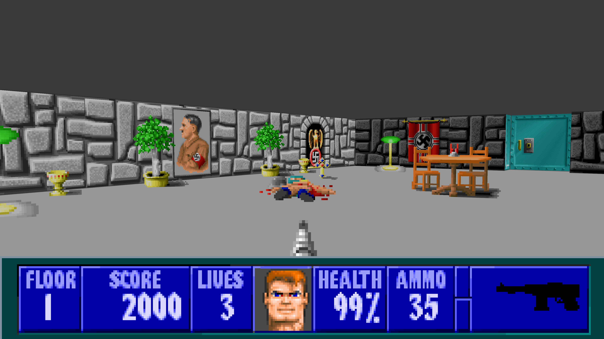
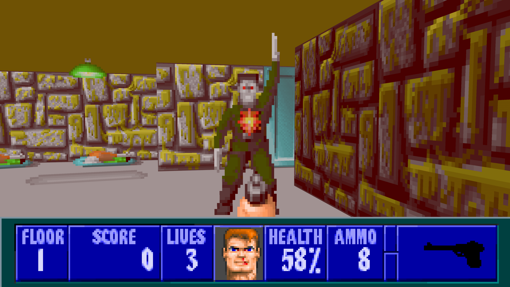
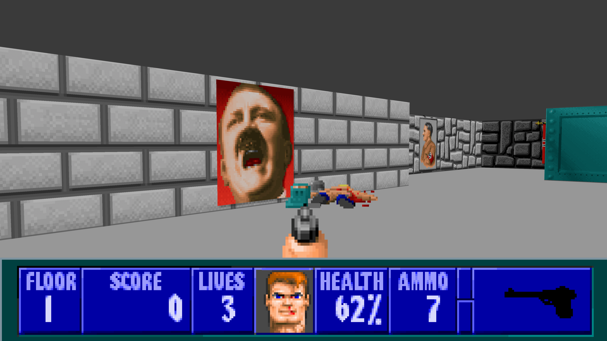
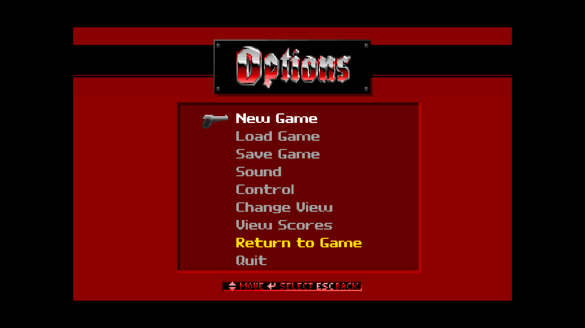

# Davenstein

A ground-up recreation of Wolfenstein 3-D, engineered entirely in Rust with Bevy. Davenstein reimplements Wolfenstein 3-D as a native, idiomatic Rust application rather than porting or wrapping the original C code or another legacy engine

Created and maintained by **[David Petnick](https://github.com/Ophois47)**



## Releases

Prebuilt packages are published on [GitHub Releases](https://github.com/Ophois47/Davenstein/releases)

| Platform | Architecture | Package | Recommended use |
| --- | --- | --- | --- |
| Windows | x86_64 | Installer | Normal Windows installation |
| Windows | x86_64 | Portable ZIP | Portable installation |
| Windows | i686 / Win32 | Installer | Normal installation on compatible 32-bit and 64-bit Windows systems |
| Windows | i686 / Win32 | Portable ZIP | Portable installation on compatible 32-bit and 64-bit Windows systems |
| Windows | ARM64 / AArch64 | Portable ZIP | Windows on ARM systems |
| Android | ARM64 / arm64-v8a | Signed APK | Direct installation on compatible 64-bit ARM Android devices |
| Linux | x86_64 | AppImage | Normal Linux desktop use |
| Linux | x86_64 | Portable TAR.GZ | Extracted portable installation |
| Linux | x86_64 / AMD64 | DEB | Native package for Debian, Ubuntu, and compatible distributions |
| Linux | x86_64 | RPM | Native package for Rocky Linux 9 and compatible Enterprise Linux 9 systems |
| Linux | x86_64 | Flatpak | Sandboxed Linux desktop installation |
| Linux | i686 / 32-bit x86 | Portable TAR.GZ | Extracted portable installation on compatible 32-bit x86 Linux systems |
| Linux | ARM64 / AArch64 | AppImage | Normal ARM64 Linux desktop use |
| Linux | ARM64 / AArch64 | Flatpak | Sandboxed ARM64 Linux desktop installation |
| Linux | ARM64 / AArch64 | Portable TAR.GZ | Extracted ARM64 portable installation |
| Linux | ARMv7 / ARMHF | Portable TAR.GZ | Extracted ARMv7 hard-float portable installation |
| Linux | RISC-V 64 / RV64GC | Portable TAR.GZ | Extracted RISC-V 64 LP64D portable installation |
| Linux | PowerPC64LE / ppc64el | Portable TAR.GZ | Extracted little-endian OpenPOWER ELF V2 portable installation |
| FreeBSD | x86_64 / AMD64 | Native PKG | Normal FreeBSD 14 installation |
| FreeBSD | x86_64 / AMD64 | Portable TAR.GZ | Extracted portable installation |
| macOS | Universal 2 (Apple Silicon + Intel) | Application ZIP | Recommended for most Macs running macOS 11 or newer |
| macOS | Apple Silicon / ARM64 | Application ZIP | Smaller package for Apple Silicon Macs |

Every release package is accompanied by a `.sha256` checksum file

Every listed release package is built and validated in continuous integration. The Android APK is signed, signature-verified, and inspected for its expected asset pack and ARM64 native library, including compatible 16 KiB ELF page alignment. The Linux i686 executable is validated as little-endian ELF32 for Intel 80386 with the `/lib/ld-linux.so.2` dynamic loader before and after portable packaging. The Windows i686 executable is validated as PE32 `IMAGE_FILE_MACHINE_I386` before packaging, after portable extraction, and after silent installation; its imported DLLs are audited, its Program Files (x86) and Registry32 placement is checked, and uninstall cleanup is verified. The macOS application bundles are signed, notarized, stapled, and verified with Gatekeeper after archiving. The Flatpak, native DEB, RPM, and FreeBSD packages are additionally installed, integrity-checked, inspected, and removed during CI. The FreeBSD package is tested inside a FreeBSD 14.4 virtual machine. Release candidate packages have also undergone interactive runtime testing on available hardware, while broader platform-specific feedback remains welcome

The i686, ARM64, ARMv7, RISC-V 64, and PowerPC64LE packages support compatible Linux systems for their respective architectures. The Linux i686 package targets little-endian 32-bit x86 systems using ELF32 and the `/lib/ld-linux.so.2` dynamic loader. The RISC-V 64 package targets RV64GC systems using the LP64D double-float ABI. The PowerPC64LE package targets little-endian 64-bit PowerPC Linux systems using the OpenPOWER ELF V2 ABI. The Windows i686 packages target the 32-bit MSVC ABI and install through the 32-bit Windows application and registry paths. The ARM packages do not imply working Raspberry Pi V3D hardware acceleration. See Compatibility below for the current Raspberry Pi status

### Davenstein 1.3.0 Highlights

- Added native Windows i686 MSVC releases with both an NSIS installer and portable ZIP
- Added Linux i686 portable releases targeting little-endian 32-bit x86 systems
- Added validated i386 native dependency preparation with `pkg-config`, linker, ELF32, machine, loader, and shared-library checks
- Added PE32 architecture validation, imported DLL auditing, 32-bit Program Files placement, Registry32, silent installation, and uninstall-cleanup verification
- Added state-aware visible touchscreen controls for gameplay, menus, and tap-to-continue screens
- Added complete touch-only menu navigation, safe explicit confirmation, game-over and intermission advancement, and gamepad/touch high-score name entry
- Changed touchscreen movement to a floating four-way D-pad with visible stick feedback while preserving drag-to-turn, fire, use, weapon, and pause controls
- Corrected the Android Application Not Responding condition and verified responsive gameplay, rendering, menus, and touch input on physical hardware
- Added touchscreen geometry, accessibility-floor, mode-selection, hit-testing, and regression tests while restoring direct Unix execution of the Android Gradle wrapper

Read the [complete Davenstein 1.3.0 technical release notes](docs/releases/1.3.0.md)

### Bug Reports

Please report all bugs to me, Dave! At: [dpetnick89@gmail.com]

Include the Davenstein version, operating system and architecture, steps to reproduce the problem, and any relevant logs or screenshots. Always remember to check the current README for existing known bugs

### Android Installation

The Android release is a signed APK for 64-bit ARM devices using the `arm64-v8a` ABI

Verify the downloaded package on Linux:

```bash
sha256sum --check Davenstein-*-Android-arm64-v8a.apk.sha256
```

Or verify it on macOS:

```bash
shasum -a 256 -c Davenstein-*-Android-arm64-v8a.apk.sha256
```

Install the APK with Android Debug Bridge:

```bash
adb install -r Davenstein-*-Android-arm64-v8a.apk
```

The APK can also be opened directly on the Android device after allowing package installation from the application used to open the downloaded file

Davenstein provides visible, state-aware touchscreen controls on Android. Gameplay displays a floating four-way movement control, drag-to-turn region, fire, use, weapon-selection, and pause controls. Menus display a direction cluster with explicit OK and BACK buttons, while splash, score, victory, game-over, and intermission screens display tap-to-continue guidance

The overlay follows the active input device, so touchscreen controls appear for touch play and hide when keyboard or gamepad input becomes active. The repeated Android Application Not Responding condition observed during development was corrected and the resulting gameplay, rendering, menus, and touch input were verified on physical hardware

Saves, high scores, and settings remain within the application's private Android storage

### Windows i686 Installation

The Windows i686 release is available as both an NSIS installer and a portable ZIP. The 32-bit executable runs on compatible 32-bit Windows systems and through the normal Win32 compatibility layer on supported 64-bit Windows systems

The installer uses the 32-bit Program Files location (`Program Files (x86)` on 64-bit Windows), writes application and uninstall metadata through Registry32, creates all-users Start Menu shortcuts, and removes the installation directory, shortcuts, and registry entries during silent or interactive uninstall

The portable ZIP contains `Davenstein.exe`, `assets.pak`, the application icon, documentation, licensing files, and `portable.flag`. Extract the complete directory before running `Davenstein.exe`; save games, high scores, and settings remain in the portable data directory beside the application

### Linux i686 Installation

Verify and extract the downloaded 32-bit x86 portable archive:

```bash
sha256sum --check Davenstein-*-linux-i686.tar.gz.sha256
tar -xzf Davenstein-*-linux-i686.tar.gz
cd Davenstein-*-linux-i686
./run-davenstein.sh
```

The executable is a little-endian Intel 80386 ELF32 binary using `/lib/ld-linux.so.2`. The target system must provide compatible 32-bit Linux runtime libraries for Wayland, libudev, ALSA, libgcc, libm, and glibc. Save games, high scores, and settings remain in the extracted package's portable data directory

### Debian / Ubuntu Installation

Install the downloaded native package:

```bash
sudo apt install ./Davenstein-*-linux-amd64.deb
```

Launch Davenstein from the desktop application menu or directly from its installed launcher:

```bash
/usr/games/Davenstein
```

Remove the package with:

```bash
sudo apt remove davenstein
```

### Rocky Linux / Enterprise Linux 9 Installation

Install the downloaded native package:

```bash
sudo dnf install ./Davenstein-*-linux-x86_64.rpm
```

Launch Davenstein from the desktop application menu or from a terminal:

```bash
Davenstein
```

Remove the package with:

```bash
sudo dnf remove davenstein
```

The native DEB and RPM packages store saves, high scores, and settings under the current user's platform data directory. The portable TAR.GZ package stores them under its own `data/` directory.

### Flatpak Installation

Install the downloaded bundle:

```bash
flatpak install --user ./Davenstein-*-linux-*.flatpak
```

Launch Davenstein:

```bash
flatpak run io.github.ophois47.davenstein
```

Remove the application with:

```bash
flatpak uninstall --user io.github.ophois47.davenstein
```

The Flatpak packages use installed storage mode and keep saves, high scores, and settings inside the Flatpak application data sandbox for the current user.

### Linux RISC-V 64 Installation

The portable RISC-V package targets RV64GC Linux systems using the LP64D double-float ABI

Extract the downloaded archive and run its launcher:

```bash
tar -xzf Davenstein-*-linux-riscv64.tar.gz
cd Davenstein-*-linux-riscv64
./run-davenstein.sh
```

The package stores saves, high scores, and settings under its own `data/` directory

### Linux PowerPC64LE Installation

The portable PowerPC64LE package targets little-endian 64-bit PowerPC Linux systems using the OpenPOWER ELF V2 ABI

Extract the downloaded archive and run its launcher:

```bash
tar -xzf Davenstein-*-linux-powerpc64le.tar.gz
cd Davenstein-*-linux-powerpc64le
./run-davenstein.sh
```

The target system must provide compatible Wayland client, libudev, ALSA, libgcc, libm, and glibc runtime libraries

The package stores saves, high scores, and settings under its own `data/` directory

### FreeBSD Installation

The native FreeBSD package is built for FreeBSD 14 on x86_64 / AMD64 systems.

Install the required runtime packages:

```sh
sudo pkg install -y \
    alsa-lib \
    libX11 \
    libXcursor \
    libXi \
    libXrandr \
    libudev-devd \
    libxkbcommon \
    wayland
```

Install the downloaded native package:

```sh
sudo pkg add Davenstein-*-freebsd-x86_64.pkg
```

Launch Davenstein from the desktop application menu or from a terminal:

```sh
Davenstein
```

Remove the native package with:

```sh
sudo pkg delete davenstein
```

For a self-contained portable installation, extract the TAR.GZ and run its launcher:

```sh
tar -xzf Davenstein-*-freebsd-x86_64.tar.gz
cd Davenstein-*-freebsd-x86_64
./run-davenstein.sh
```

The portable package stores saves, high scores, and settings under its own `data/` directory. The native package stores saves, high scores, and settings under the current user's platform data directory.

### macOS First Launch

The macOS application packages are signed with a Developer ID certificate, notarized by Apple, and include stapled notarization tickets

After extracting the ZIP, open `Davenstein.app` normally. Gatekeeper should accept the application as a notarized Developer ID package without requiring a security override

If macOS reports that the application cannot be verified, confirm the downloaded ZIP against its `.sha256` file and download a fresh copy from this repository. Do not bypass Gatekeeper for a package that fails checksum or signature verification

### Verify a Checksum

Linux:

```bash
sha256sum --check Davenstein-*.sha256
```

macOS:

```bash
shasum -a 256 -c Davenstein-*.sha256
```

FreeBSD:

```sh
for artifact in \
    Davenstein-*-freebsd-x86_64.pkg \
    Davenstein-*-freebsd-x86_64.tar.gz
do
    expected=$(awk 'NR == 1 { print $1 }' "$artifact.sha256")
    actual=$(sha256 -q "$artifact")

    test "$actual" = "$expected" || exit 1
    echo "$artifact: OK"
done
```

## Build

### Linux

On Ubuntu, install the required native build dependencies once:

```bash
./scripts/setup-ubuntu.sh
```

Build the release executable and rebuild `assets.pak` into `target/release`

```bash
./scripts/build_create_assets.sh
```

Or build manually with:

```bash
cargo build --release
cargo run --bin pak_builder --release -- --root assets --out target/release/assets.pak
```

### Windows PowerShell

Build the release executable and rebuild `assets.pak` into `target\release`

```powershell
.\scripts\build_create_assets.ps1
```

If PowerShell blocks the script, run it once with:

```powershell
powershell -ExecutionPolicy Bypass -File .\scripts\build_create_assets.ps1
```

### Windows i686 MSVC

Install the 32-bit Windows MSVC Rust target:

```powershell
rustup target add i686-pc-windows-msvc
```

Build the native Win32 executable:

```powershell
cargo build `
    --release `
    --target i686-pc-windows-msvc `
    --bin Davenstein
```

This build requires the Visual Studio 2022 C++ x86 build tools and a compatible Windows SDK. The automated release job runs on a native Windows runner, validates the original and packaged executables as PE32 `IMAGE_FILE_MACHINE_I386`, audits imported DLLs, and exercises the completed installer through silent installation and removal

### Android ARM64

Android builds require Java 21, the Android SDK and NDK versions declared in `android/gradle.properties`, and `cargo-ndk` 4.1.2

Install the Rust Android target and `cargo-ndk`:

```bash
rustup target add aarch64-linux-android
cargo install cargo-ndk --version 4.1.2
```

Build the Android asset pack and its checksum:

```bash
rm -rf target/android-assets
mkdir -p target/release target/android-assets

rustc --edition=2024 -O \
    src/pak_builder.rs \
    -o target/release/pak_builder

target/release/pak_builder \
    --root assets \
    --out target/android-assets/assets.pak

python3 -c 'import hashlib, pathlib; p = pathlib.Path("target/android-assets/assets.pak"); pathlib.Path(str(p) + ".sha256").write_text(hashlib.sha256(p.read_bytes()).hexdigest() + "\n")'
```

Build the ARM64 native library using the minimum API level from the committed Android configuration:

```bash
ANDROID_MIN_SDK=$(sed -n 's/^davenstein.minSdk=//p' android/gradle.properties)

cargo ndk \
    -t arm64-v8a \
    -P "$ANDROID_MIN_SDK" \
    -o target/android-jniLibs \
    build \
    --release \
    --lib
```

Assemble the local release APK:

```bash
(
    cd android

    ./gradlew \
        --no-daemon \
        --stacktrace \
        "-Pdavenstein.abis=arm64-v8a" \
        app:assembleRelease
)
```

The local Gradle output is unsigned. The GitHub Android release workflow performs 16 KiB alignment, release signing, signer and package verification, APK content inspection, checksum creation, and publication

## Cross Compilation

Cross-compiling requires a container engine, either Podman or Docker, and the `cross` tool

```bash
cargo install cross --git https://github.com/cross-rs/cross
```

On Fedora, or any Podman host, tell `cross` to use Podman

```bash
export CROSS_CONTAINER_ENGINE=podman
```

### Windows GNU

```bash
cross build --release --target x86_64-pc-windows-gnu --target-dir target/win
```

### Linux i686 GNU

The Linux i686 release uses the target configuration in `Cross.toml` and `scripts/cross_prepare_i686.sh` to install and validate the required i386 development interfaces inside the maintained cross-compilation environment

```bash
cross build \
    --release \
    --target i686-unknown-linux-gnu \
    --features software_render \
    --bin Davenstein
```

On Apple Silicon macOS, run the maintained amd64 cross image through Docker or Colima with:

```bash
CROSS_CONTAINER_OPTS="--platform linux/amd64" \
CROSS_BUILD_OPTS="--platform linux/amd64" \
CARGO_BUILD_JOBS=4 \
cross build \
    --release \
    --target i686-unknown-linux-gnu \
    --features software_render \
    --bin Davenstein
```

The preparation script validates the required i386 `pkg-config` interfaces, links an ELF32 target probe, and verifies the Intel 80386 machine identity and `/lib/ld-linux.so.2` dynamic loader before Davenstein is compiled

### Linux ARM64 GNU

```bash
cross build --release --target aarch64-unknown-linux-gnu --bin Davenstein
```

### Linux ARMv7 GNU

```bash
cross build --release --target armv7-unknown-linux-gnueabihf --target-dir target/arm
```

### Linux RISC-V 64 GNU

The RISC-V release uses the target configuration in `Cross.toml` to install the required target-architecture Linux libraries

```bash
cross build \
    --release \
    --target riscv64gc-unknown-linux-gnu \
    --features software_render \
    --bin Davenstein
```

### Linux PowerPC64LE GNU

The PowerPC64LE release uses the target configuration in `Cross.toml` and `scripts/cross_prepare_powerpc64le.sh` to download and extract the required `ppc64el` Linux development libraries without installing foreign glibc packages

```bash
cross build \
    --release \
    --target powerpc64le-unknown-linux-gnu \
    --features software_render \
    --bin Davenstein
```

On Apple Silicon macOS, run the maintained amd64 cross image through Docker or Colima with:

```bash
CROSS_CONTAINER_OPTS="--platform linux/amd64" \
CROSS_BUILD_OPTS="--platform linux/amd64" \
CARGO_BUILD_JOBS=1 \
cross build \
    --release \
    --target powerpc64le-unknown-linux-gnu \
    --features software_render \
    --bin Davenstein
```

The preparation script validates the PowerPC64LE native libraries, links a target-architecture probe, and verifies the OpenPOWER ELF V2 ABI and `/lib64/ld64.so.2` dynamic loader before Davenstein is compiled

### FreeBSD x86_64

FreeBSD releases are cross-compiled from Linux using the target configuration in `Cross.toml`.

Build the FreeBSD release executable:

```bash
cross build \
    --release \
    --target x86_64-unknown-freebsd \
    --bin Davenstein
```

The portable TAR.GZ is assembled with:

```bash
packaging/freebsd/build-portable.sh
```

The native `.pkg` is created under FreeBSD with:

```sh
packaging/freebsd/build-package.sh
```

The release workflow builds and validates both formats, including native installation and removal inside a FreeBSD 14.4 virtual machine.

## Assets Pak

### Build or Rebuild `assets.pak`

```bash
cargo run --bin pak_builder --release -- --root assets --out dist/assets.pak
```

### Build or Rebuild `assets.pak` in the Release Directory

```bash
cargo run --bin pak_builder --release -- --root assets --out target/release/assets.pak
```

## Compatibility

- Raspberry Pi 5 / V3D: not currently supported. Bevy's GPU rendering does not yet work on the Pi's V3D driver (Vulkan renders incorrectly, OpenGL can't present via wgpu), and the CPU software renderer, while correct, runs below playable framerates. This is an upstream limitation in Bevy/wgpu/Mesa, not a bug. Will revisit when V3D GPU support matures.

## Screenshots

<p align="center">
	
	
</p>

<p align="center">
	
</p>

## Licensing and Third-Party Material

Davenstein's original software is available under either the MIT License or the Apache License, Version 2.0, at your option. See [`LICENSE.md`](LICENSE.md), [`LICENSE-MIT`](LICENSE-MIT), and [`LICENSE-APACHE`](LICENSE-APACHE).

Those software licenses do not apply to Wolfenstein 3D graphics, sounds, music, maps, characters, names, trademarks, or other third-party material included with or depicted by the project. Davenstein does not claim ownership of that material and does not grant permission to reuse or redistribute it.

Davenstein is an independent, unofficial project and is not affiliated with, sponsored by, approved by, or endorsed by ZeniMax Media, Bethesda Softworks, id Software, or Microsoft. Known asset provenance and unresolved rights information are documented in [`THIRD_PARTY_ASSETS.md`](THIRD_PARTY_ASSETS.md).
